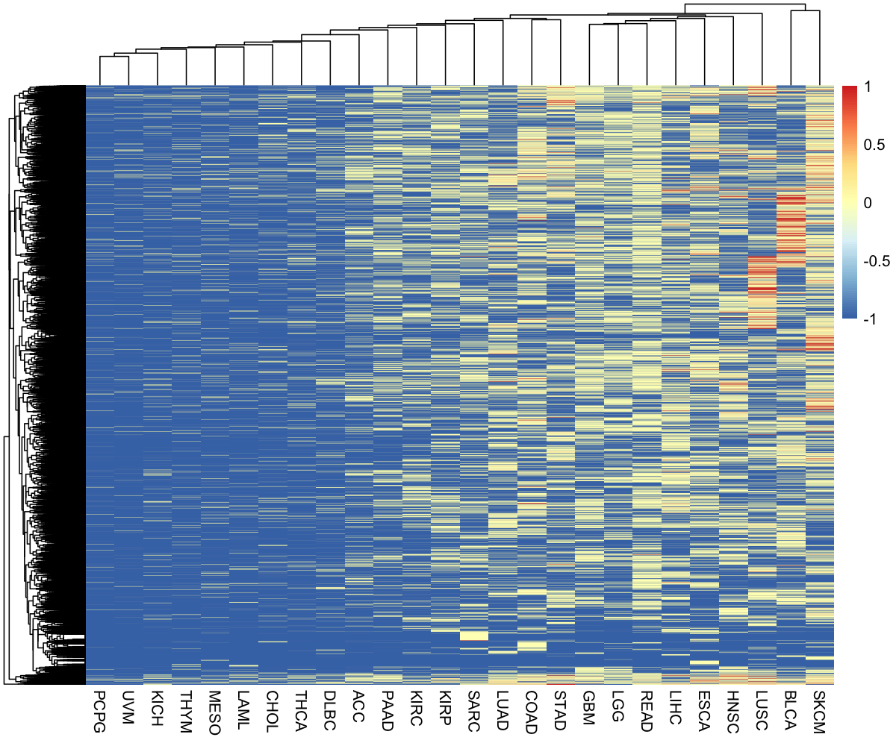

Differences in the Cancer Mutational Landscape
================
Chris Holt
3/May/2019

# Aim

 The central dogma of cancer is that loss of normal
structure leads to loss of normal function and uncontrolled cellular
proliferation. There is a cyclic cycle of increased cellular
proliferation leading to an increase in cellular mutations and the
increase in cellular mutations can lead to an increase in cellular
proliferation. This results in damage to the body and tumour growth that
we know as cancer. The mutational landscape refers to different
populations having a different distribution of mutation types such was
what types of mutations are common, which genes are mutated, the types
of nucleotide mutations etcetera. We can already see sex differences in
cancer epidemiology, such as the mortality rate of certain cancers and
the outcome of certain drug regimens (2). Sex differences have also been
observed at the molecular level. In metastatic melanoma, it was found
that males had a statistically higher burden of missense mutations(4).
This paper found that, as bladder cancer mutations are most common in
histone demethylases such as KDM6A, which is located on the X
chromosome, females with bladder cancer have a higher number of KDM6A
mutations, and thus a more aggressive tumour (3). The aim of the project
is to analyse the mutational landscape and determine if there are
sex-derived differences that could affect the mutational landscape.

# Question

 How does the mutational landscape differ between males
and females in the 33 publically available datasets from The Cancer
Genome Atlas (TCGA)? 

# Scope

 This dataset contains clinical and mutational data,
curated by TCGA, from cancer patients in the United States 

# Methods

 Mutational and Clinical Data will be downloaded from
<a href="https://portal.gdc.cancer.gov/" target="_blank">The Cancer
Genome Atlas</a> via an R package called TCGAbiolinks(1). TCGAbiolinks
will download the
<a href="https://portal.gdc.cancer.gov/repository?filters=%7B%22op%22%3A%22and%22%2C%22content%22%3A%5B%7B%22op%22%3A%22in%22%2C%22content%22%3A%7B%22field%22%3A%22files.access%22%2C%22value%22%3A%5B%22open%22%5D%7D%7D%2C%7B%22op%22%3A%22in%22%2C%22content%22%3A%7B%22field%22%3A%22files.analysis.workflow_type%22%2C%22value%22%3A%5B%22SomaticSniper%20Variant%20Aggregation%20and%20Masking%22%5D%7D%7D%2C%7B%22op%22%3A%22in%22%2C%22content%22%3A%7B%22field%22%3A%22files.experimental_strategy%22%2C%22value%22%3A%5B%22WXS%22%5D%7D%7D%5D%7D" target="_blank">maf.gz
files</a> as data objects in R and I will write them out as tsv files
for future use. I will be utilising the
<a href="https://www.ncbi.nlm.nih.gov/pmc/articles/PMC3268238/" target="_blank">SomaticSniper</a>
pipeline. Statistcally analyses were performed using the wilcoxon rank
sum test and an alpha value of less than 0.05. This analysis will look
at differences in the mutation types, nucleotide changes, transitions vs
transversions, chromosmal location of mutations, and gene significance.

# Results

<!-- These should aready be in the environment. Do not need to run -->

<!-- Do not need to run this, files have already been downloaded, takes ~20min to run -->

<!-- Should not have to run this as total cancers should already be in the environment -->

    ## # A tibble: 10 x 2
    ##    cohort Full_Name                                                       
    ##    <chr>  <chr>                                                           
    ##  1 ACC    Adrenocortical carcinoma                                        
    ##  2 BLCA   Bladder Urothelial Carcinoma                                    
    ##  3 BRCA   Breast invasive carcinoma                                       
    ##  4 CESC   Cervical squamous cell carcinoma and endocervical adenocarcinoma
    ##  5 CHOL   Cholangiocarcinoma                                              
    ##  6 COAD   Colon adenocarcinoma                                            
    ##  7 DLBC   Lymphoid Neoplasm Diffuse Large B-cell Lymphoma                 
    ##  8 ESCA   Esophageal carcinoma                                            
    ##  9 GBM    Glioblastoma multiforme                                         
    ## 10 HNSC   Head and Neck squamous cell carcinoma

**Sample of the cancer cohorts and their full
names**

### Proportion of sex in each cancer

**Certain cancer cohorts are sex-biased where as others have a similar
amount of males and females in the dataset. The cancers that are
sex-biased (PRAD, BRCA, CESC, OV, UCEC, UCS) were removed from this
analysis.**

<!-- Has already been run. Do not need to run again -->

### Percentage of Mutation Types

**The majority of mutation types in all the cohorts were missense
mutations.**

<!-- This chunk takes a while to run-->

### Proportion of Nucleotide Changes

**The majority of nucleotide changes in most cancers were G \> A (Ti)
and C \> T (Ti). Nucleotide mutations in SKCM were almost entirely
composed of these two nucleotide changes. In LAML, females had a higher
proportion of G \> A and C \> T mutations than males, whereas in SARC,
males had a higher
proportion**

<!-- Transitions vs Transversion-->

### Proportion of Transitions and Transversions

**Transitions are the majority of mutation types in both males and
females across cohorts. In a couple of cohorts, transversions were more
common.**

### Chromosomal Location

**The majority of mutations occur on chromosome 1. However, in certain
cancers (for example KICH), females had more mutations on chromosome 7
where as males had more mutations on chromosome 19 (second to the
proportionof mutations on chromosome 1)**

### Gene Significance across Cancers

<i> -1 means that the gene is not found in that cohort  
0 means that the gene is found in the cohort, but that it is not
statistically significant  
1 means that the gene is found in the cohort and that it is statistcally
significant</i>

**The cancers on the left side of the heat map appeared to suffer
mutations in a very select subset of genes, whereas a lot more genes are
associated with cancers on the right. By the location of the red bars,
their appears to be few sites of overlap between genes that were
signifciantly mutated in any cohort.**

# Main Conclusions

 There are genomic differences in the mutational
landscape between males and females across the cancer datasets. Looking
at Lung adenocarcinoma (LUAD), the dataset contains more females than
males(0.42, 0.48). The difference in 3’UTR, Missense\_Mutation, Silent
mutations between males and females was found to be statistically
significant (p = 0.011, 0.003, 0.001). Differences in certain nucleotide
changes was found to be significant. The differences between A \> G, A
\> T, C \> G, C \> T, G \> A, G \> C, G \> T, T \> C were found to be
statistically significant (p = 0.027, 0.009, 0.021, 0.001, 0, 0.028,
0.008, 0.002). Females had more transitions than males (M = 0.393,
0.388) while females had less transversions than males (M = 0.617,
0.621). The differences in transitions and tranversions between males
and females were found to be statistically significant in LUAD (p = 0,
0.006). Transitions are defined as a mutation that converts a purine to
purine (or pyrimidine to pyrimidine). Transversions are defined as
mutation that converts a purine to pyrimidine or vice versa (Ti = G \>
A, A \> G, C \> T, T \> C, Tv = G \> C, C \> A, T \> A, C \> G, A \> C,
G \> T, A \> T, T \> G). However, the general overall pattern of the
landscape appears to be the same. Males and females have similar
proportions of mutation types, more transitions than transversion, and
the majority of mutations occur on chromosome 1 in similar propotions.

Looking at Gene Significance across Cancers, ten of the cancer cohorts
have mutations in very few of the 21086 unique genes found in the
dataset. Also looking at the graph, there is not much overlap between
cancers of genes that are found to be statistically significant between
males and females.

While this analysis lays the groundwork for analysing the mutational
landscapes, more work has to be done to with regards to correcting the
*p* value (FDR, Bonferroni etcetera), as well as looking into the
effects of other factors such as smoking, exposure to chemicals, diet,
age, and family history. Another area of exploration is why were the
majority of nucleotide changes, across cohorts G \> A and C \> T
mutations?

# References

### Methods

 1. Colaprico A, Silva TC, Olsen C, Garofano L, Cava C,
Garolini D, Sabedot T, Malta TM, Pagnotta SM, Castiglioni I, Ceccarelli
M, Bontempi G, Noushmehr H (2015). “ TCGAbiolinks: An R/Bioconductor
package for integrative analysis of TCGA data.” Nucleic Acids Research.
doi: 10.1093/nar/gkv1507,
<a href="http://doi.org/10.1093/nar/gkv1507" target="_blank">http://doi.org/10.1093/nar/gkv1507</a>  

### Aim

 2. Kim, Hae-In, et al. “Sex Differences in Cancer:
Epidemiology, Genetics and Therapy.” Biomolecules & Therapeutics, The
Korean Society of Applied Pharmacology, July 2018,
<a href="https://www.ncbi.nlm.nih.gov/pmc/articles/PMC6029678/" target="_blank">www.ncbi.nlm.nih.gov/pmc/articles/PMC6029678/</a>  
3\. Messing, Edward M. “Molecular Landscape of Non-Muscle Invasive
Bladder Cancer.” Bladder Cancer, vol. 4, no. 1, 2018, pp. 131–132.,
<a href="https://www.ncbi.nlm.nih.gov/pubmed/29136502" target="_blank">doi:10.3233/blc-189027</a>  
4\. Gupta, Sameer, et al. “Gender Disparity and Mutation Burden in
Metastatic Melanoma.” Journal of the National Cancer Institute, Oxford
University Press, 20 Aug. 2015,
<a href="https://www.ncbi.nlm.nih.gov/pubmed/26296643" target="_blank">https://www.ncbi.nlm.nih.gov/pubmed/26296643</a>

