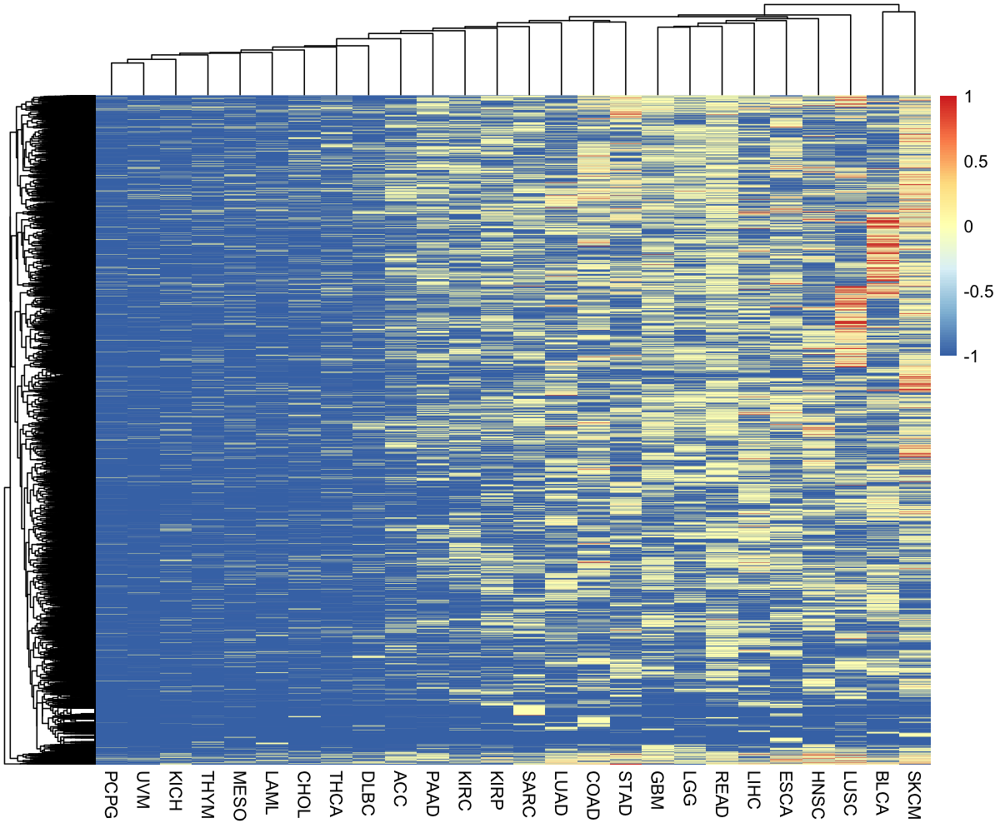

# Aim 

<font size = 4>
The central dogma of cancer is that loss of normal structure leads to loss of normal function and uncontrolled cellular proliferation. There is a cyclic cycle of increased cellular proliferation leading to an increase in cellular mutations and the increase in cellular mutations can lead to an increase in cellular proliferation. This results in damage to the body and tumour growth that we know as cancer. The mutational landscape refers to different populations having a different distribution of mutation types such was what types of mutations are common, which genes are mutated, the types of nucleotide mutations etcetera. We can already see sex differences in cancer epidemiology, such as the mortality rate of certain cancers and the outcome of certain drug regimens (2). Sex differences have also been observed at the molecular level. In metastatic melanoma, it was found that males had a statistically higher burden of missense mutations(4). This paper found that, as bladder cancer mutations are most common in histone demethylases such as KDM6A, which is located on the X chromosome, females with bladder cancer have a higher number of KDM6A mutations, and thus a more aggressive tumour (3). The aim of the project is to analyse the mutational landscape and determine if there are sex-derived differences that could affect the mutational landscape. 
</font>

# Question
<font size = 4>
How does the mutational landscape differ between males and females in the 33 publically available datasets from The Cancer Genome Atlas (TCGA)?
</font> 


# Scope

<font size = 4>
This dataset contains clinical and mutational data, curated by TCGA, from cancer patients in the United States
</font>

# Methods

<font size = 4>
Mutational and Clinical Data will be downloaded from <a href="https://portal.gdc.cancer.gov/" target="_blank">The Cancer Genome Atlas</a> via an R package called TCGAbiolinks(1). TCGAbiolinks will download the <a href="https://portal.gdc.cancer.gov/repository?filters=%7B%22op%22%3A%22and%22%2C%22content%22%3A%5B%7B%22op%22%3A%22in%22%2C%22content%22%3A%7B%22field%22%3A%22files.access%22%2C%22value%22%3A%5B%22open%22%5D%7D%7D%2C%7B%22op%22%3A%22in%22%2C%22content%22%3A%7B%22field%22%3A%22files.analysis.workflow_type%22%2C%22value%22%3A%5B%22SomaticSniper%20Variant%20Aggregation%20and%20Masking%22%5D%7D%7D%2C%7B%22op%22%3A%22in%22%2C%22content%22%3A%7B%22field%22%3A%22files.experimental_strategy%22%2C%22value%22%3A%5B%22WXS%22%5D%7D%7D%5D%7D" target="_blank">maf.gz files</a> as data objects in R and I will write them out as tsv files for future use. 
I will be utilising the <a href="https://www.ncbi.nlm.nih.gov/pmc/articles/PMC3268238/" target="_blank">SomaticSniper</a> pipeline. Statistcally analyses were performed using the wilcoxon rank sum test and an alpha value of less than 0.05. This analysis will look at differences in the mutation types, nucleotide changes, transitions vs transversions, chromosmal location of mutations, and gene significance. 
</font>

```{r Loading main packages/define caption, echo=FALSE, message=FALSE, include=FALSE}
library(tidyverse)
library(dendsort)
library(pheatmap)

cap <- "p < 0.05 as calculated by wilcoxon rank sum test\nData from https://portal.gdc.cancer.gov/"

```
```{r Loading Functions, echo=FALSE, message=FALSE, include=FALSE}
source("functions.R")

```
```{r TCGAbiolinks, echo=FALSE, message=FALSE, include=FALSE, eval=FALSE}
if (!requireNamespace("TCGAbiolinks", quietly = TRUE)){
  install.packages("BiocManager")
  BiocManager::install("TCGAbiolinks", version = "3.8")
  library(TCGAbiolinks)
}else{
  library(TCGAbiolinks)
}
```

# Results

<!-- These should aready be in the environment. Do not need to run -->
```{r Defining Main Cancer Names, echo=FALSE, message=FALSE, eval=FALSE}
## Gathers the cancer cohorts 
Cancers <- getGDCprojects()$project_id %>%
  enframe() %>% select(value) %>% rename("cancer" = "value") %>% 
  filter(grepl("^TCGA.*$", cancer))

Cancers$cancer <- Cancers$cancer %>% str_remove("TCGA-") %>% sort()
Cancers <- Cancers %>% pull()

```

<!-- Do not need to run this, files have already been downloaded, takes ~20min to run -->
```{r Download the Data, echo=FALSE, eval=FALSE, message=FALSE, include=FALSE}
columnsofInterest <- c("tumor_barcode", "primary_diagnosis", "tumor_stage", "gender", 
                       "mut_type", "nucchange", "hugo_symbol", "disease",
                       "chromosome", "gene", "exon_number", 
                       "variant_classification", "mutation_status")


setwd("Datasets/")
for (i in 1:length(Cancers)){
  tryCatch({
  clin <- download_clinical(Cancers[i]) ## download clinical data
  mut <- download_mutational(Cancers[i]) ## download mutational data
  mut <- classify_Changes(mut) ## classify nucleotide changes and transitions vs transversion
  total <- inner_join(clin,mut, by = "tumor_barcode") ## merge clinical and mutational data
  total_sub <- total %>% select(one_of(columnsofInterest)) %>% rename("sex" = "gender")
  colnames(total_sub) <- colnames(total_sub) %>% str_to_lower()
  write_delim(total_sub, paste0(Cancers[i], "_select.csv"), delim = "\t")
  }, error = function(e){})
}

## manually delete GDCdata folder. It is not needed and takes up too much space

setwd("../")
```
<!-- Should not have to run this as total cancers should already be in the environment -->
```{r Create large dataframe containing all cancer info, echo=FALSE, message=FALSE, warning=FALSE, eval=FALSE}
## Write in the flat files of the previous chunk into one data frame
total_cancers <- tibble()
for (i in 1:length(Cancers)){
  df <- read_delim(paste0("Datasets/", Cancers[i], "_select.csv"), delim = "\t", progress = FALSE)
  df$cohort <- paste0(Cancers[i])
  total_cancers <- rbind(total_cancers, df)
}
```


```{r echo=FALSE, warning=FALSE, message=FALSE}
full_names <- read_csv("full_names.csv", col_names = FALSE)
head(full_names %>% rename("cohort" = "X1", "Full_Name" = "X2") %>% filter(cohort != "CNTL", cohort != "FPPP") %>% arrange(cohort), n = 10)
```

**Sample of the cancer cohorts and their full names**


```{r Dataframe that contains cancer proportions, echo=FALSE, message=FALSE, warning=FALSE}
## calculate the number of people (per sex) in each cohort
df_count <- total_cancers %>%
  select(tumor_barcode, sex, cohort) %>% distinct() %>%
  group_by(sex, cohort) %>% count() %>% ungroup() %>% group_by(cohort) %>%
  mutate(percentage = round(n/sum(n),2)) %>% ungroup()

### This code reorders the cohort as factors so that the first graph has the highest frequencies for male and female at opposite ends and the middle cancers have the most equal proportions
m <- df_count %>% filter(sex == "male")
m$cohort <- factor(m$cohort, levels = m$cohort[order(-m$percentage)])
f <- df_count %>% filter(sex == "female")
f$cohort <- factor(f$cohort, levels = f$cohort[order(-f$percentage)])
combined_count <- rbind(m,f)

```

### Proportion of sex in each cancer
```{r Graphing percentages of males vs females, echo=FALSE, fig.align='center'}
ggplot(combined_count) + 
  geom_bar(aes(x = cohort, y = percentage, fill = sex), 
           stat = "identity", position = "dodge") + coord_flip() +
  scale_fill_manual(values = c("red","blue")) + labs(
    title = "Proportion of Males vs Females for each Cancer"
  ) +
  labs(
    caption = "Data from https://portal.gdc.cancer.gov/"
  ) + theme(plot.caption = element_text(face = "italic"))

```
**Certain cancer cohorts are sex-biased where as others have a similar amount of males and females in the dataset. The cancers that are sex-biased (`r combined_count %>% filter(percentage > 0.9) %>% .$cohort`) were removed from this analysis.** 

```{r, removing cancers that are sex-biased, echo=FALSE, message=FALSE, warning=FALSE}
## Remove sex-biased cancers
total_cancers_select <- total_cancers %>% filter(!(cohort %in% c("UCS", "UCEC", "OV", "CESC", "BRCA", "TGCT", "PRAD")))

```

<!-- Has already been run. Do not need to run again -->
```{r This will write out the result of gene_freq and use pValues.py to calculate pValues, echo=FALSE, warning=FALSE, include=FALSE, eval=FALSE}
## Use gene_freq function to find the number of mutations for each person for each gene in each cohort. Download as flat files to be run in pValue.py
select_canc <- unique(total_cancers_select$cohort)
for(k in 1:length(select_canc)){
  temp <- total_cancers_select %>% filter(cohort == select_canc[k])
  temp1 <- gene_freq(temp)
  write_delim(temp1, paste0("Datasets/", select_canc[k], "_gene_frequencies.csv"), delim = "\t")

}
```


```{r Df that shows the percentage of each variant classification, echo=FALSE, message=FALSE, warning=FALSE}
## This first one get the proportion of each variant classification for each sex in each cohort
total_variant_classification <- total_cancers_select %>% filter(variant_classification %in% c("Missense_Mutation", "Nonsense_Mutation", "Silent", "5'UTR", "3'UTR")) %>% group_by(cohort, sex) %>% count(variant_classification) %>% mutate(perc = n/sum(n)) %>%
  ungroup()

## This gets the number of mutations (for each variant classification) per person in each cohort. This set will be used in calc_pValues to get significance
range_vc <- total_cancers_select %>% filter(variant_classification %in% c("Missense_Mutation", "Nonsense_Mutation", "Silent", "5'UTR", "3'UTR")) %>% group_by(cohort, sex, tumor_barcode) %>% count(variant_classification) %>% ungroup()

```


```{r calculate significance for variant_class, echo=FALSE, message=FALSE, warning=FALSE}
vc_sig <- calc_pValues(range_vc, "variant_classification")
```

### Percentage of Mutation Types
```{r variant classification between male and female, echo=FALSE, fig.align='center', fig.asp=1}

## This will merge in pValues back in to plot on the bargraph
total_variant_sig <- total_variant_classification %>% inner_join(vc_sig, by = c("cohort", "variant_classification")) %>% na.omit()

isolated_pvalue <- total_variant_sig %>% select(cohort, variant_classification, sig) %>% distinct()

ggplot(total_variant_sig) + 
  geom_bar(aes(x = variant_classification, y = perc, fill = sex, group = sex), stat = "identity",position = "dodge") + coord_flip() + facet_wrap(~cohort) +
  geom_point(data = isolated_pvalue[isolated_pvalue$sig ==1, ],aes(x=variant_classification, y = sig),shape = "*", size=5, show.legend = FALSE,
             color = "black") +
  scale_fill_manual(values = c("female" = "red", "male" = "blue")) +
  labs(
    title = "Missense Mutations are the most prevelant type of mutation",
    y = "percentage",
    x = "Mutation Classification",
    caption = cap

  ) + scale_y_continuous(breaks = c(0, 0.5, 0.8)) + theme(plot.caption = element_text(face = "italic"))

## The asterixs are double placed, as the pValues are repeated for male and female

```
**The majority of mutation types in all the cohorts were missense mutations.** 


```{r Looking at nucleotide changes, echo=FALSE, message=FALSE, warning=FALSE}
## This will be used for pValue calculation
nuc_range <- total_cancers_select %>% filter(!(nucchange %in% c("deletion", "insertion","other"))) %>% select(cohort,tumor_barcode, nucchange, sex) %>%
  group_by(cohort, tumor_barcode, nucchange, sex) %>% count()

## This will be used for bargraph
nucleotide_changes <- total_cancers_select %>% filter(!(nucchange %in% c("deletion", "insertion","other"))) %>% select(cohort,tumor_barcode, nucchange, sex) %>% group_by(cohort, sex) %>% count(nucchange) %>% mutate(perc = n/sum(n)) %>%
  ungroup()  
```

<!-- This chunk takes a while to run-->
```{r dataframe of nucleotidechanges, echo=FALSE, message=FALSE, warning=FALSE}
nc_sig <- calc_pValues(nuc_range, "nucchange")
```

### Proportion of Nucleotide Changes

```{r nucleotide changes between male and female, echo=FALSE, fig.align='center', fig.asp=1.5}
total_nc_sig <- nucleotide_changes %>% inner_join(nc_sig, by = c("cohort", "nucchange"))

isloated_nuc_pvalue <- total_nc_sig %>% select(cohort, nucchange, sig) %>% distinct()

isloated_nuc_pvalue$loc <- 0.6

ggplot(total_nc_sig) + 
  geom_bar(aes(x = nucchange, y = perc, fill = sex, group = sex), stat = "identity",position = "dodge") + coord_flip() + facet_wrap(~cohort) +
  geom_point(data = isloated_nuc_pvalue[isloated_nuc_pvalue$sig ==1, ],aes(x=nucchange, y = loc),shape = "*", size=5, show.legend = FALSE,
             color = "black") +
  scale_fill_manual(values = c("female" = "red", "male" = "blue")) +
  labs(
    title = "Different proportions of nucleotide changes",
    subtitle = "G > A, C > T mutations appear to be the most common",
    y = "percentage",
    x = "Nucleotide Changes",
    caption = cap
   ) + scale_y_continuous(breaks = c(0.5)) + theme(plot.caption = element_text(face = "italic"))

## The asterixs are double placed, as the pValues are repeated for male and female

```
**The majority of nucleotide changes in most cancers were G > A (Ti) and C > T (Ti). Nucleotide mutations in SKCM were almost entirely composed of these two nucleotide changes. In LAML, females had a higher proportion of G > A and C > T mutations than males, whereas in SARC, males had a higher proportion**

<!-- Transitions vs Transversion-->
```{r Dataframe for comparing transitions vs transversions, echo=FALSE, message=FALSE, warning=FALSE}
## This will find the number of Ti/Tv per person in each cohort
TiTv <- total_cancers_select %>% select(cohort,tumor_barcode, mut_type, sex) %>%
  group_by(cohort, tumor_barcode, mut_type, sex) %>% count() %>% na.omit() %>% ungroup() %>%
  group_by(cohort, tumor_barcode, sex) %>% mutate(perc = round(n/sum(n), 2)) %>% ungroup()
```

```{r calc pValues, echo=FALSE, message=FALSE, warning=FALSE}
TiTv_sig <- calc_pValues(TiTv, "mut_type")
```
### Proportion of Transitions and Transversions

```{r ti vs tv between male and female, echo=FALSE, fig.align='center', fig.asp=1.5}
total_titv_sig <- TiTv %>% inner_join(TiTv_sig, by = c("cohort", "mut_type"))

isloated_titv_pvalue <- total_titv_sig %>% select(cohort, mut_type, sex, sig) %>% distinct()

isloated_titv_pvalue$loc <- 1.3

ggplot(TiTv) + 
  geom_boxplot(aes(x = mut_type, y = perc, fill = sex)) + facet_wrap(~cohort) +
  geom_point(data = isloated_titv_pvalue[isloated_titv_pvalue$sig ==1, ],aes(x=mut_type, y = loc),shape = "*", size=5, show.legend = FALSE,
             color = "black") +
  scale_fill_manual(values = c("female" = "red", "male" = "blue")) +
  labs(
    title = "Different proportions of Transitions and Transversions",
    y = "percentage",
    x = "",
    caption = cap
   ) + theme(plot.caption = element_text(face = "italic"))

```
**Transitions are the majority of mutation types in both males and females across cohorts. In a couple of cohorts, transversions were more common.** 


### Chromosomal Location

```{r chromosmal, echo=FALSE, message=FALSE, warning=FALSE}
## This will find the total proportion of mutations per sex per chromosme per cohort
chrom <- total_cancers_select %>% select(cohort, chromosome, sex) %>%
  group_by(cohort, chromosome, sex) %>% count() %>% na.omit() %>% ungroup() %>%
  group_by(cohort, sex) %>% mutate(perc = round(n/sum(n), 2)) %>% ungroup()

ind_chrom <- total_cancers_select %>% select(cohort, tumor_barcode, chromosome, sex) %>%
  group_by(cohort, tumor_barcode, chromosome, sex) %>% count() %>% na.omit() %>% ungroup()
```

```{r chromsome pvalue, echo=FALSE, message=FALSE, warning=FALSE}
sig_chrom <- calc_pValues(ind_chrom, "chromosome")
sig_chrom <- sig_chrom %>% filter(!(is.nan(pValue)))
```

```{r chromosomal graph, echo=FALSE, fig.align='center', fig.asp=2}
ggplot(chrom %>% filter(perc > 0)) + geom_bar(aes(x = reorder(chromosome, -perc),y = perc, fill = sex), stat = "identity", position = "dodge") + facet_wrap(~cohort)+
  coord_flip() + 
  scale_y_continuous(breaks = c(0.05, 0.15)) + scale_fill_manual(values = c("female" = "red", "male" = "blue")) +
  geom_point(data = sig_chrom[sig_chrom$sig ==1, ],aes(x=chromosome, y = 0.15),shape = "*", size=5, show.legend = FALSE,
             color = "black") + 
  labs(
    title = "Percentage of mutated Genes located on each chromosome",
    y = "percentage",
    x = "Chromosome",
    caption = cap
   ) +
  theme(axis.text.y = element_text(size = 10),
        plot.caption = element_text(face = "italic"))
```
**The majority of mutations occur on chromosome 1. However, in certain cancers (for example KICH), females had more mutations on chromosome 7 where as males had more mutations on chromosome 19 (second to the proportionof mutations on chromosome 1)** 

```{r Read in result of pValue.py to 1 dataframe, echo=FALSE, warning=FALSE, message=FALSE}
## This chunk reads in the pValues calculated by pValue.py (pvalues per gene in each cohort)
select_canc <- unique(total_cancers_select$cohort)

pValue_df <- tribble()

for (i in 1:length(select_canc)){
  temp_df <- read_delim(paste0("Datasets/",select_canc[i], "_pvalues.tsv"), delim = "\t")
  temp_df <- temp_df %>% mutate(sig = ifelse(temp_df$pvalue < 0.05, "1", "0"))
  pValue_df <- rbind(pValue_df, temp_df)

}
pValue_df <- pValue_df %>% rename("pValue" = "pvalue")

```

### Gene Significance across Cancers

```{r sig_genes_matrix, echo=FALSE, warning=FALSE}
## This creates a matrix for pheatmap
is_sig <- pValue_df %>% select(gene, disease, sig) %>% spread(key = disease, value = sig)
is_sig[is.na(is_sig)] <- -1 ## -1 means gene not foun in cohort, 0 means found, not sig, 1 means sig

is_sig_mat <- is_sig %>% remove_rownames() %>% column_to_rownames(var="gene")
mat <- as.matrix(sapply(is_sig_mat, as.numeric))

```
```{r Cluster rows and columns, echo=FALSE, warning=FALSE}

## cluster the rows and columns
mat_cluster_cols <- sort_hclust(hclust(dist(t(mat))))
mat_cluster_rows <- sort_hclust(hclust(dist(mat)))
```

```{r Generate Heatmap, echo=FALSE, warning=FALSE, include=FALSE}
clust_heat <- pheatmap(mat,
         cluster_cols = mat_cluster_cols,
         cluster_rows = mat_cluster_rows,
         show_rownames     = FALSE)
pheatsave(clust_heat, "clust_sig_graph_1.png") ## To view his file separately, open it in MS paint
```



<div style="text-align: right"><i> 
-1 means that the gene is not found in that cohort  
0 means that the gene is found in the cohort, but that it is not statistically significant  
1 means that the gene is found in the cohort and that it is statistcally significant</i>  
</div>

**The cancers on the left side of the heat map appeared to suffer mutations in a very select subset of genes, whereas a lot more genes are associated with cancers on the right. By the location of the red bars, their appears to be few sites of overlap between genes that were signifciantly mutated in any cohort.** 


```{r Cancer to discuss, echo=FALSE, include=FALSE, warning=FALSE}
cancer <- "LUAD"

```

# Main Conclusions  
<font size = 4>
There are genomic differences in the mutational landscape between males and females across the cancer datasets. Looking at `r full_names %>% filter(X1 == paste(cancer)) %>% .$X2` (`r paste0(cancer)`), the dataset contains more females than males(`r combined_count %>% filter(cohort == paste0(cancer)) %>% .$percentage`). The difference in `r total_variant_sig %>% select(variant_classification, sig, cohort) %>% filter(sig == 1, cohort == paste0(cancer)) %>% distinct() %>% .$variant_classification` mutations between males and females was found to be statistically significant (p = `r total_variant_sig %>% filter(sig == '1', cohort == paste0(cancer)) %>% select(variant_classification, pValue) %>% distinct() %>% .$pValue %>% round(3)`). Differences in certain nucleotide changes was found to be significant. The differences between `r total_nc_sig %>% filter(sig == '1', cohort == paste0(cancer)) %>% select(nucchange, pValue) %>% distinct() %>% .$nucchange` were found to be statistically significant (p = `r total_nc_sig %>% filter(sig == '1', cohort == paste0(cancer)) %>% select(nucchange, pValue) %>% distinct() %>% .$pValue %>% round(3)`). Females had more transitions than males (M = `r total_titv_sig %>% filter(cohort == paste0(cancer)) %>% group_by(sex, mut_type) %>% summarise(means = mean(perc)) %>% ungroup() %>% filter(mut_type == "Ti") %>% .$means %>% round(3)`) while females had less transversions than males (M = `r total_titv_sig %>% filter(cohort == paste0(cancer)) %>% group_by(sex, mut_type) %>% summarise(means = mean(perc)) %>% ungroup() %>% filter(mut_type == "Tv") %>% .$means %>% round(3)`). The differences in transitions and tranversions between males and females were found to be statistically significant in `r paste(cancer)` (p = `r total_titv_sig %>% filter(sig == '1', cohort == paste0(cancer)) %>% select(mut_type, pValue) %>% distinct() %>% .$pValue %>% round(3)`). Transitions are defined as a mutation that converts a purine to purine (or pyrimidine to pyrimidine). Transversions are defined as mutation that converts a purine to pyrimidine or vice versa (Ti = `r total_cancers_select %>% select(nucchange, mut_type) %>% distinct() %>% filter(mut_type == "Ti") %>% .$nucchange`, Tv = `r total_cancers_select %>% select(nucchange, mut_type) %>% distinct() %>% filter(mut_type == "Tv") %>% .$nucchange`). However, the general overall pattern of the landscape appears to be the same. Males and females have similar proportions of mutation types, more transitions than transversion, and the majority of mutations occur on chromosome 1 in similar propotions.  

Looking at Gene Significance across Cancers, ten of the cancer cohorts have mutations in very few of the `r total_cancers_select %>% select(hugo_symbol) %>% distinct(hugo_symbol) %>% count() %>% .$n` unique genes found in the dataset. Also looking at the graph, there is not much overlap between cancers of genes that are found to be  statistically significant between males and females.  

While this analysis lays the groundwork for analysing the mutational landscapes, more work has to be done to with regards to correcting the *p* value (FDR, Bonferroni etcetera), as well as looking into the effects of other factors such as smoking, exposure to chemicals, diet, age, and family history. Another area of exploration is why were the majority of nucleotide changes, across cohorts G > A and C > T mutations?

</font>


# References

### Methods
<font size = 4>
1. Colaprico A, Silva TC, Olsen C, Garofano L, Cava C, Garolini D, Sabedot T, Malta TM, Pagnotta SM, Castiglioni I, Ceccarelli M, Bontempi G, Noushmehr H (2015). “ TCGAbiolinks: An R/Bioconductor package for integrative analysis of TCGA data.” Nucleic Acids Research. doi: 10.1093/nar/gkv1507, <a href="http://doi.org/10.1093/nar/gkv1507" target="_blank">http://doi.org/10.1093/nar/gkv1507</a>  
</font>

### Aim
<font size = 4>
2. Kim, Hae-In, et al. “Sex Differences in Cancer: Epidemiology, Genetics and Therapy.” Biomolecules & Therapeutics, The Korean Society of Applied Pharmacology, July 2018, <a href="https://www.ncbi.nlm.nih.gov/pmc/articles/PMC6029678/" target="_blank">www.ncbi.nlm.nih.gov/pmc/articles/PMC6029678/</a>  
3. Messing, Edward M. “Molecular Landscape of Non-Muscle Invasive Bladder Cancer.” Bladder Cancer, vol. 4, no. 1, 2018, pp. 131–132., 
<a href="https://www.ncbi.nlm.nih.gov/pubmed/29136502" target="_blank">doi:10.3233/blc-189027</a>  
4. Gupta, Sameer, et al. “Gender Disparity and Mutation Burden in Metastatic Melanoma.” Journal of the National Cancer Institute, Oxford University Press, 20 Aug. 2015, <a href="https://www.ncbi.nlm.nih.gov/pubmed/26296643" target="_blank">https://www.ncbi.nlm.nih.gov/pubmed/26296643</a>

</font>


